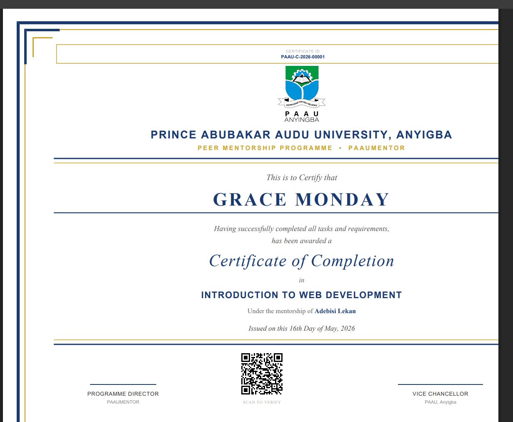

# PAAUMENTOR

> A peer mentorship platform built for Prince Abubakar Audu University (PAAU), Anyigba, Nigeria.

PAAUMENTOR connects students with senior peers and alumni as mentors, providing structured learning paths, AI-powered tools, session management, and a certificate pipeline — all in one platform.

---

## Features

**For Mentees**
- Browse and request verified mentors with AI-powered smart matching
- Follow structured learning paths with task submissions and mentor grading
- Earn verifiable certificates with QR codes upon path completion
- Schedule video, voice, and chat sessions
- AI Study Buddy for academic questions (powered by Gemini)
- Apply to become a mentor after meeting requirements

**For Mentors**
- Create and manage learning paths with modules and tasks
- Grade task submissions and provide feedback
- Manage mentee sessions and write recommendations
- Track mentee progress with charts

**For Admins / Verifiers**
- Approve mentor portfolios and upgrade requests
- View platform-wide stats: users, sessions, certificates, top skills
- Manage and suspend users

**Platform-wide**
- Real-time-style messaging between mentor and mentee
- Study groups with group chat
- Skill exchange between students
- Shared resource library
- In-app notification system
- Dark mode support
- Fully responsive design

---

## Tech Stack

| Layer | Technology |
|---|---|
| Backend | Laravel 11 (PHP 8.2+) |
| Database | MySQL |
| Frontend | Blade + Vanilla CSS/JS (no heavy framework) |
| AI | Google Gemini 2.5 Flash |
| PDF | barryvdh/laravel-dompdf |
| QR Codes | chillerlan/php-qrcode |
| Assets | Vite + Tailwind CSS |
| Local Dev | XAMPP |

---

## Screenshots

> Dashboard · Learning Paths · Sessions · Certificates · Admin Dashboard

### Certificate with QR Code
   

---

## Quick Start

See [SETUP.md](SETUP.md) for full installation instructions.

```bash
git clone https://github.com/MosesGoddey/paaumentor.git
cd paaumentor
composer install
cp .env.example .env
# configure .env (database + GEMINI_API_KEY)
php artisan key:generate
php artisan migrate --seed
php artisan storage:link
npm install && npm run build
php artisan serve
```

---

## Demo Credentials

| Role | Login | Password |
|---|---|---|
| Admin | admin@paau.edu.ng | password |
| Mentee | 23CS1004 *(student ID)* | password |
| Mentor | amaka@paau.edu.ng | password |
| Verifier | verifier@paau.edu.ng | password |

---

## Project Structure

```
app/
  Http/Controllers/     — All route controllers
  Models/               — Eloquent models
  Services/
    AiService.php       — Gemini: mentor matching, learning paths, study buddy
    GeminiService.php   — Gemini: assessment question generation
resources/views/        — Blade templates
public/
  css/style.css         — Main stylesheet
  js/app.js             — Charts, theme toggle, shared utilities
database/
  migrations/           — All table schemas
  seeders/              — Demo data seeder
```

---

## Key Workflows

**Certificate Pipeline**
Mentee completes all tasks → Mentor grades → AI generates 30-question assessment → Mentee passes (70%) → Mentor writes reflection → Verifier reviews → Certificate issued with QR code

**Mentor Upgrade**
Mentee meets requirements (5 sessions, 1 certificate, 1 completed path, active mentor) → AI generates upgrade assessment → Mentee passes → Mentor writes recommendation → Admin approves → Role upgraded to mentor

---

## Environment Variables

```env
DB_CONNECTION=mysql
DB_HOST=127.0.0.1
DB_PORT=3306
DB_DATABASE=
DB_USERNAME=root
DB_PASSWORD=

MAIL_MAILER=smtp
MAIL_HOST=smtp.gmail.com
MAIL_PORT=587
MAIL_USERNAME=your@gmail.com
MAIL_PASSWORD=your_app_password

GEMINI_API_KEY=your_gemini_api_key_here
```

Get a free Gemini API key at [aistudio.google.com/apikey](https://aistudio.google.com/apikey).

---

## Developed By

**Moses Goddey Joseph** —
Department of Computer Science  
Prince Abubakar Audu University, Anyigba, Nigeria  

Supervisor: Mr. Richard Akomodi

---

## License

MIT
